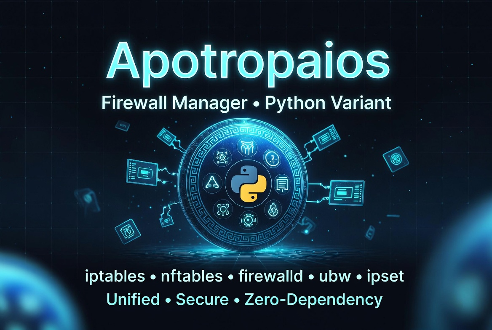

<a id="top"></a>

<p align="center">
  
</p>

<h1 align="center">Apotropaios - Firewall Manager (Python Variant)</h1>
<p align="center">
  A unified, security-focused firewall management framework for Linux<br>supporting five backends with zero external runtime dependencies.
</p>

<p align="center">
  
  
  
  
</p>

<p align="center">
  <a href="https://github.com/Sandler73/Apotropaios-Firewall-Manager-Python-Variant/actions/workflows/ci.yml"></a>
  <a href="https://github.com/Sandler73/Apotropaios-Firewall-Manager-Python-Variant/actions/workflows/security.yml"></a>
  <a href="https://github.com/Sandler73/Apotropaios-Firewall-Manager-Python-Variant/actions/workflows/codeql.yml"></a>
  <a href="https://github.com/Sandler73/Apotropaios-Firewall-Manager-Python-Variant/actions/workflows/docs-validate.yml"></a>
</p>

<p align="center">
  
  
  
  
</p>

<p align="center">
  
  
  
</p>

<p align="center">
  <a href="#quick-start">Quick Start</a> ·
  <a href="#cli-command-reference">Commands</a> ·
  <a href="USAGE_GUIDE.md">Usage Guide</a> ·
  <a href="CHANGELOG.md">Changelog</a> ·
  <a href="SECURITY.md">Security</a> ·
  <a href="#testing">Testing</a> ·
  <a href="#contributing">Contributing</a>
</p>

<p align="center">
  📖 <a href="wiki/Home.md"><strong>Explore the Wiki Documentation »</strong></a>
</p>

---

## Table of Contents

- [Overview](#overview)
- [Key Highlights](#key-highlights)
- [Features](#features)
  - [Core Capabilities](#core-capabilities)
  - [Input Validation and Security](#input-validation-and-security)
  - [Logging and Audit](#logging-and-audit)
- [Architecture](#architecture)
  - [Layer Model](#layer-model)
  - [Rule Lifecycle](#rule-lifecycle)
  - [Compound Action Translation](#compound-action-translation)
- [Supported Platforms](#supported-platforms)
- [Supported Firewalls](#supported-firewalls)
- [Prerequisites](#prerequisites)
- [Quick Start](#quick-start)
  - [CLI Examples](#cli-examples)
- [CLI Command Reference](#cli-command-reference)
  - [detect](#detect)
  - [add-rule](#add-rule)
  - [remove-rule](#remove-rule)
  - [list-rules](#list-rules)
  - [activate-rule / deactivate-rule](#activate-rule--deactivate-rule)
  - [import / export](#import--export)
  - [backup / restore](#backup--restore)
  - [block-all / allow-all](#block-all--allow-all)
  - [install / update](#install--update)
  - [status / system-rules](#status--system-rules)
  - [menu / --interactive](#menu----interactive)
- [Global Options](#global-options)
- [Rule Lifecycle](#rule-lifecycle-1)
- [Compound Actions](#compound-actions)
- [Connection Tracking](#connection-tracking)
- [Rate Limiting](#rate-limiting)
- [Backup and Recovery](#backup-and-recovery)
- [Logging](#logging)
- [Directory Structure](#directory-structure)
- [Security Considerations](#security-considerations)
- [Troubleshooting](#troubleshooting)
- [Testing](#testing)
- [Contributing](#contributing)
- [Documentation](#documentation)
- [Version History](#version-history)
- [Acknowledgments](#acknowledgments)
- [License](#license)
- [Support](#support)

---

## Overview

Apotrópaios (from Greek *ἀποτρόπαιος* -- "turning away evil") is a zero-dependency Python 3.12+ framework for unified firewall management across multiple backends and Linux distributions. It wraps the complexity of five different firewall tools -- **iptables**, **nftables**, **firewalld**, **ufw**, and **ipset** -- into a single, consistent interface with UUID-tracked rule lifecycle management, full backup/recovery, and defense-in-depth security controls at every layer.

This is the **Python variant** of the [bash Apotropaios framework](https://github.com/Sandler73/Apotropaios-Firewall-Manager), targeting 100% feature parity with v1.1.10. The Python implementation uses strict typing (`mypy --strict` with zero errors), a 5-layer architecture with enforced dependency ordering, and 322 automated tests across unit, integration, and security tiers.

Every firewall rule created through Apotropaios receives a unique **UUID**, is tracked in a persistent rule index, and supports full lifecycle operations: create, activate, deactivate, remove, and automatic TTL-based expiry. The framework handles the translation between its unified rule model and each backend's native syntax -- compound actions like `log,drop` become separate LOG + terminal rules in iptables, single expressions in nftables, rich rule log clauses in firewalld, and extracted terminal actions in ufw.

The framework emphasizes security at every layer: 27 whitelist input validators, shell injection prevention via list-form subprocess calls (never `shell=True`), secure file permissions (0o600/0o700), atomic file locking via `fcntl.flock()`, cryptographic integrity verification, and automatic masking of sensitive data in logs across four format families.

<p align="right">(<a href="#table-of-contents">back to top</a>)</p>

---

## Key Highlights

| | Feature | Description |
|---|---------|-------------|
| 🔥 | **Five Firewall Backends** | iptables, nftables, firewalld, ufw, ipset -- auto-detected and selectable |
| 🆔 | **UUID Rule Tracking** | Every rule gets a UUID for lifecycle management: create, activate, deactivate, remove, expire |
| 🔀 | **Compound Actions** | `log,drop` and `log,accept` translated natively per backend -- no wrapper scripts |
| 📊 | **Connection Tracking** | `new`, `established`, `related`, `invalid`, `untracked` states on any rule |
| ⏱️ | **Rate Limiting** | `5/minute`, `10/second`, `100/hour` with configurable burst -- per-rule granularity |
| 🖥️ | **Interactive Menu** | 8-category guided interface with validation, cancel support, and ExpiryMonitor daemon |
| 💾 | **Backup & Recovery** | Timestamped compressed archives, immutable `chattr +i` snapshots, SHA-256 verification |
| 📦 | **Import / Export** | Portable rule configurations with integrity verification and dry-run preview |
| 🛡️ | **Security-First Design** | 27 whitelist validators, CWE-mapped test suite, OWASP/NIST-aligned controls |
| 📝 | **Structured Logging** | Correlation IDs, 4-family sensitive data masking, secure rotation |
| ❓ | **Progressive Help** | Two-tier: global `--help`, per-command `COMMAND --help` (18 commands) |
| ⚡ | **Zero Runtime Dependencies** | Python 3.12+ stdlib only -- no pip packages required at runtime |
| 🔒 | **Type-Safe** | `mypy --strict` with zero errors across all 35 source files |

<p align="right">(<a href="#table-of-contents">back to top</a>)</p>

---

## Features

### Core Capabilities

- **Unified multi-backend management**: Consistent CLI and menu across iptables, nftables, firewalld, ufw, and ipset
- **Automatic backend detection**: Scans installed firewalls, auto-selects the best available, or lets you choose with `--backend`
- **UUID rule lifecycle**: Create, activate, deactivate, remove, and automatic TTL-based expiry with full audit trail
- **Compound actions**: `log,drop`, `log,accept`, `log,reject` -- translated to each backend's native representation
- **Connection state tracking**: `--conn-state new,established,related` on any rule, mapped to conntrack/ct state per backend
- **Rate limiting**: `--limit 5/minute --limit-burst 10` for traffic shaping, translated to `-m limit` (iptables), `limit rate` (nftables), or rich rule limit (firewalld)
- **Configuration portability**: Import/export rule sets with SHA-256 integrity verification and dry-run preview
- **Backup and recovery**: Automatic restore points before destructive operations, timestamped compressed archives, and immutable `chattr +i` snapshots
- **21 CLI commands**: Each with `--help` providing synopsis, options, examples, and related commands
- **Interactive menu**: 8-category guided interface with input validation and cancel support
- **System-native rules**: View raw backend rules via `system-rules` (iptables -L, nft list, firewall-cmd --list-all, etc.)

### Input Validation and Security

- 27 whitelist validators for all user-supplied data types (ports, IPs, CIDRs, protocols, hostnames, paths, chains, tables, table families, zones, interfaces, rule IDs, actions, connection states, rate limits, log levels, log prefixes, descriptions)
- Whitelist-based input sanitization -- `sanitize_input()` keeps only known-safe characters via compiled regex
- Shell metacharacter rejection via O(1) frozenset intersection (`_contains_shell_meta()`)
- Path traversal detection and null byte injection rejection on all file path parameters
- Maximum input length enforcement (4096 characters)
- nftables table family validation (inet, ip, ip6, arp, bridge, netdev)
- Parameter re-validation from rule index before removal operations
- No `eval` or `exec` of user-supplied data; no `shell=True` in any subprocess call
- All subprocess calls use list-form arguments with captured stderr and 30-second timeout

See [SECURITY.md](SECURITY.md) for the full security design, implemented controls, and CWE coverage.

### Logging and Audit

- Structured log format with ISO 8601 UTC timestamps and correlation IDs
- Seven log levels: TRACE, DEBUG, INFO, WARNING, ERROR, CRITICAL, NONE
- Dual output: color-coded console (stderr) and structured file
- Automatic log rotation at 100MB with configurable retention (default: 10 files)
- Sensitive data masking across four format families: key=value, key="quoted", JSON (`"key": "value"`), and HTTP Authorization headers
- Control character stripping prevents log injection
- Log files written with 0o600 permissions, log directories with 0o700
- Console handler removed before shutdown marker -- no post-shutdown noise

<p align="right">(<a href="#table-of-contents">back to top</a>)</p>

---

## Architecture

### Layer Model

```
┌──────────────────────────────────────────────────────────────────┐
│                    Layer 5: User Interface                        │
│    cli.py (18 commands)  ·  menu/main.py  ·  help_system.py     │
├──────────────────────────────────────────────────────────────────┤
│                    Layer 4: Rule Engine                           │
│    rules/engine.py  ·  rules/index.py  ·  rules/state.py        │
│    rules/import_export.py  ·  backup/  ·  install/installer.py  │
├──────────────────────────────────────────────────────────────────┤
│                    Layer 3: Firewall Backends                     │
│    firewall/common.py (registry + dispatch)                      │
│    iptables.py · nftables.py · firewalld.py · ufw.py · ipset.py │
├──────────────────────────────────────────────────────────────────┤
│                    Layer 2: Detection                             │
│    detection/os_detect.py  ·  detection/fw_detect.py             │
├──────────────────────────────────────────────────────────────────┤
│                    Layer 1: Core Infrastructure                   │
│    constants.py · validation.py · logging.py · errors.py         │
│    security.py  · utils.py                                       │
└──────────────────────────────────────────────────────────────────┘
```

**Key design decisions:**

1. **Whitelist-first validation**: Every user input passes through whitelist pattern matching before reaching any system command. Validators use compiled regex patterns (precompiled at import, thread-safe).

2. **List-form command construction**: All firewall commands are built using Python lists (`["iptables", "-A", "INPUT", "-p", protocol]`), never string interpolation or `shell=True`. This prevents shell injection regardless of input content.

3. **Backend-native translation**: The rule engine validates the superset of options, then each backend adapter translates to its native syntax. Compound actions, connection tracking, and rate limiting are expressed differently across backends but validated identically.

4. **Atomic file locking**: `fcntl.flock()` is used for race-condition-free file locking with stale PID detection and configurable timeout.

5. **Defense-in-depth logging**: Sensitive data is masked before writing to any handler. Control characters are stripped. Log files have restricted permissions. Console handler removed before shutdown to prevent noise.

### Rule Lifecycle

```
                    ┌──────────┐
                    │  CREATE   │
                    │ (UUID)    │
                    └────┬─────┘
                         │
                    ┌────▼─────┐
              ┌─────│  ACTIVE   │─────┐
              │     └────┬─────┘     │
              │          │           │
         ┌────▼───┐  ┌──▼────┐  ┌──▼──────┐
         │DEACTIVE│  │EXPIRED│  │ REMOVED  │
         │(index) │  │ (TTL) │  │(backend  │
         └────┬───┘  └───────┘  │ + index) │
              │                  └──────────┘
         ┌────▼─────┐
         │REACTIVATE│
         └────┬─────┘
              │
         ┌────▼─────┐
         │  ACTIVE   │
         └──────────┘
```

Every rule passes through: **validation** (27 validators) → **engine** (UUID assignment, index registration) → **backend adapter** (native command construction) → **kernel** (firewall rule applied). Deactivation removes from the kernel but preserves the index entry for reactivation. Removal deletes from both.

### Compound Action Translation

A compound action like `log,drop` is expressed differently by each backend:

| Backend | Native Translation |
|:--------|:-------------------|
| **iptables** | Two separate rules: `-j LOG --log-prefix "..." --log-level info` followed by `-j DROP` |
| **nftables** | Single expression: `log prefix "..." level info drop` |
| **firewalld** | Rich rule with log clause: `rule ... log prefix "..." level info drop` |
| **ufw** | Terminal action extracted for ufw verb; logging enabled via `ufw logging` |

Removal mirrors the add logic exactly -- for iptables, both the LOG rule and the terminal rule are deleted to prevent orphaned kernel rules.

<p align="right">(<a href="#table-of-contents">back to top</a>)</p>

---

## Supported Platforms

| Distribution | Version | Family | Package Manager | CI Status |
|:-------------|:--------|:-------|:----------------|:----------|
| **Ubuntu** | 22.04 LTS, 24.04 LTS | Debian | apt | ✅ Verified |
| **Kali Linux** | Rolling | Debian | apt | ✅ Verified |
| **Debian** | 12 (Bookworm) | Debian | apt | ✅ Verified |
| **Rocky Linux** | 8, 9 | RHEL | dnf | ✅ Verified |
| **AlmaLinux** | 8, 9 | RHEL | dnf | ✅ Verified |
| **Arch Linux** | Rolling | Arch | pacman | ✅ Verified |

**Also expected to work** on any Linux distribution with Python 3.12+ and standard coreutils, including Fedora, openSUSE, Amazon Linux 2023, and Raspberry Pi OS.

<p align="right">(<a href="#table-of-contents">back to top</a>)</p>

---

## Supported Firewalls

| Backend | Binary | Description | Status |
|:--------|:-------|:------------|:-------|
| **iptables** | `iptables` | Legacy netfilter packet filtering with compound action support | ✅ Full Support |
| **nftables** | `nft` | Modern netfilter framework with native compound expressions | ✅ Full Support |
| **firewalld** | `firewall-cmd` | Dynamic firewall with zones and rich rules | ✅ Full Support |
| **ufw** | `ufw` | Uncomplicated Firewall with application profiles | ✅ Full Support |
| **ipset** | `ipset` | IP set management with iptables integration | ✅ Full Support |

<p align="right">(<a href="#table-of-contents">back to top</a>)</p>

---

## Prerequisites

### Required

| Dependency | Purpose | Install |
|------------|---------|---------|
| **Python** 3.12+ | Framework runtime (type annotations, stdlib modules) | Pre-installed on most modern distributions |
| **At least one firewall** | Backend for rule management | See [install command](#install--update) |

### Optional (Development)

| Dependency | Purpose | Install |
|------------|---------|---------|
| **pytest** 8.0+ | Automated testing | `pip3 install pytest` |
| **mypy** 1.10+ | Static type checking | `pip3 install mypy` |
| **Git** | Version control | Pre-installed on most distributions |

### System Requirements

- Root/sudo access for firewall operations (kernel-level packet filtering)
- Python 3.12+ for modern type annotation syntax (`X | None`, `dict[str, str]`)
- No external runtime dependencies -- stdlib only, no pip packages required

<p align="right">(<a href="#table-of-contents">back to top</a>)</p>

---

## Quick Start

```bash
# 1. Clone or download
git clone https://github.com/Sandler73/Apotropaios-Firewall-Manager-Python-Variant.git
cd Apotropaios-Firewall-Manager-Python

# 2. Detect your system (no install needed)
sudo python3 apotropaios.py detect

# 3. Launch the interactive menu
sudo python3 apotropaios.py --interactive

# Or use the CLI directly:
sudo python3 apotropaios.py add-rule --dst-port 443 --action accept --protocol tcp
sudo python3 apotropaios.py list-rules
sudo python3 apotropaios.py backup pre-deploy
```

**Three execution modes:**

- **Direct execution** (`python3 apotropaios.py`): No installation required. Works from the project root.
- **Module execution** (`python3 -m apotropaios`): After `pip3 install .` or within a venv.
- **Interactive mode** (`--interactive`): Launches the guided 8-category menu.

**Alternative install methods**: See [SETUP_GUIDE.md](SETUP_GUIDE.md) for venv setup, system-wide pip install, and first-run instructions.

### CLI Examples

Quick copy-paste examples for common operations. See the [Usage Guide](USAGE_GUIDE.md) for complete options and operational scenarios.

**Add rules** -- Create firewall rules with various options:
```bash
sudo python3 apotropaios.py add-rule --dst-port 443 --action accept --protocol tcp
sudo python3 apotropaios.py add-rule --src-ip 10.0.0.0/8 --action drop --direction inbound
sudo python3 apotropaios.py add-rule --dst-port 22 --action log,drop --conn-state new --limit 3/minute
sudo python3 apotropaios.py add-rule --dst-port 80 --action accept --duration temporary --ttl 3600
```

**Manage rules** -- Lifecycle operations on existing rules:
```bash
sudo python3 apotropaios.py list-rules                    # Show all tracked rules
sudo python3 apotropaios.py remove-rule <UUID>            # Remove a specific rule
sudo python3 apotropaios.py deactivate-rule <UUID>        # Deactivate (keep in index)
sudo python3 apotropaios.py activate-rule <UUID>          # Reactivate a deactivated rule
```

**Import / Export** -- Portable rule configurations:
```bash
sudo python3 apotropaios.py export /tmp/my-rules.conf     # Export current rules
sudo python3 apotropaios.py import /tmp/my-rules.conf     # Import rules from file
sudo python3 apotropaios.py import rules.conf --dry-run   # Preview without applying
```

**Backup / Restore** -- Protect your configuration:
```bash
sudo python3 apotropaios.py backup pre-deploy             # Create a named backup
sudo python3 apotropaios.py restore backup.tar.gz         # Restore from specific backup
```

**Quick actions** -- Emergency operations:
```bash
sudo python3 apotropaios.py block-all                     # Block all traffic
sudo python3 apotropaios.py allow-all                     # Allow all traffic
```

**System information** -- Diagnostics:
```bash
sudo python3 apotropaios.py detect                        # Scan OS and firewalls
sudo python3 apotropaios.py status                        # Show service state
sudo python3 apotropaios.py system-rules                  # Show raw backend rules
sudo python3 apotropaios.py detect --log-level debug      # Maximum diagnostic detail
```

<p align="right">(<a href="#table-of-contents">back to top</a>)</p>

---

## CLI Command Reference

### detect

Scan the system for installed operating system, firewall backends, and their current status.

```bash
sudo python3 apotropaios.py detect
```

Outputs: detected OS (name, version, family, package manager), installed firewalls (with binary paths and service status), and auto-selected backend.

### add-rule

Create and apply a new firewall rule. The rule is validated, assigned a UUID, applied to the active backend, and registered in the rule index.

```bash
sudo python3 apotropaios.py add-rule [OPTIONS]
```

| Option | Description |
|--------|-------------|
| `--protocol <PROTO>` | Protocol: tcp, udp, icmp, icmpv6, sctp, all (default: tcp) |
| `--src-ip <IP/CIDR>` | Source IP address or CIDR |
| `--dst-ip <IP/CIDR>` | Destination IP address or CIDR |
| `--src-port <PORT>` | Source port or port range (e.g., 8080-8090) |
| `--dst-port <PORT>` | Destination port or port range |
| `--action <ACTION>` | Rule action: accept, drop, reject, log, masquerade, snat, dnat, return, or compound (log,drop) |
| `--direction <DIR>` | Traffic direction: inbound, outbound, forward |
| `--conn-state <STATES>` | Connection tracking: new, established, related, invalid, untracked (comma-separated) |
| `--limit <RATE>` | Rate limit: N/second, N/minute, N/hour, N/day |
| `--limit-burst <N>` | Burst allowance for rate limiting |
| `--log-prefix <PREFIX>` | Log prefix string (max 29 chars) |
| `--log-level <LEVEL>` | Syslog level: emerg, alert, crit, err, warning, notice, info, debug |
| `--zone <ZONE>` | Firewalld zone name |
| `--interface <IFACE>` | Network interface |
| `--chain <CHAIN>` | Custom chain name (iptables/nftables) |
| `--table <TABLE>` | Custom table name (iptables/nftables) |
| `--duration <TYPE>` | Duration: permanent or temporary |
| `--ttl <SECONDS>` | Time-to-live for temporary rules (60–2592000 seconds) |
| `--description <TEXT>` | Human-readable rule description |

### remove-rule

Remove a rule by its UUID. Deletes from both the firewall backend and the rule index.

```bash
sudo python3 apotropaios.py remove-rule <UUID>
```

### list-rules

Display all rules tracked in the rule index with their UUIDs, parameters, and current state.

```bash
sudo python3 apotropaios.py list-rules
```

### activate-rule / deactivate-rule

Toggle a rule's active state. Deactivation removes the rule from the firewall backend but preserves it in the index for later reactivation.

```bash
sudo python3 apotropaios.py deactivate-rule <UUID>
sudo python3 apotropaios.py activate-rule <UUID>
```

### import / export

Transfer rule configurations between systems or environments. Export produces a portable configuration file with SHA-256 integrity checksum. Import validates the checksum before applying.

```bash
sudo python3 apotropaios.py export /path/to/rules.conf
sudo python3 apotropaios.py import /path/to/rules.conf
sudo python3 apotropaios.py import /path/to/rules.conf --dry-run
```

Import supports `--dry-run` to preview rules without applying them.

### backup / restore

Create and restore timestamped backup archives of the complete framework state (rule index, state tracking, per-backend configs).

```bash
sudo python3 apotropaios.py backup [LABEL]           # Create backup with optional label
sudo python3 apotropaios.py restore [BACKUP_FILE]    # Restore from specific backup
```

Backups are compressed tar.gz archives with SHA-256 checksums. Up to 20 backups are retained (configurable). Immutable snapshots can be created via the interactive menu.

### block-all / allow-all

Emergency actions that set default chain policies across the active backend.

```bash
sudo python3 apotropaios.py block-all     # DROP all traffic
sudo python3 apotropaios.py allow-all     # ACCEPT all traffic
```

**Warning**: `block-all` will block all network traffic including SSH. Ensure you have out-of-band access before using this on remote systems.

### install / update

Install or update firewall packages via the system package manager.

```bash
sudo python3 apotropaios.py install <FIREWALL>    # Install a firewall backend
sudo python3 apotropaios.py update <FIREWALL>     # Update a firewall backend
```

Supported targets: `firewalld`, `iptables`, `nftables`, `ufw`, `ipset`. Auto-detects package manager (apt, dnf, pacman).

### status / system-rules

Display the active backend's service state or raw system rules.

```bash
sudo python3 apotropaios.py status          # Service state (running/enabled/version)
sudo python3 apotropaios.py system-rules    # Raw rules (iptables -L, nft list, etc.)
```

**Important distinction**: `status` shows service state (running/stopped, enabled/disabled, version, binary). `system-rules` dumps native firewall rules. `list-rules` shows only Apotropaios-tracked rules.

### menu / --interactive

Launch the interactive menu-driven interface.

```bash
sudo python3 apotropaios.py --interactive                     # Preferred
sudo python3 apotropaios.py --interactive --backend iptables  # Pre-select backend
sudo python3 apotropaios.py menu                              # Backward compatible
```

The `--interactive` flag is mutually exclusive with CLI commands and `--non-interactive`. The menu provides eight categories: Firewall Management, Rule Management, Quick Actions, Backup & Recovery, System Information, Install & Update, Help & Documentation, and Exit.

<p align="right">(<a href="#table-of-contents">back to top</a>)</p>

---

## Global Options

These options work before or after the command (position-independent):

| Option | Description |
|--------|-------------|
| `--interactive` | Launch the interactive menu (mutually exclusive with commands and `--non-interactive`) |
| `--backend <NAME>` | Select firewall backend: iptables, nftables, firewalld, ufw, ipset |
| `--log-level <LEVEL>` | Set console verbosity: trace, debug, info, warning (default), error, critical |
| `--non-interactive` | Suppress interactive prompts; destructive commands such as `reset` proceed without confirmation (for scripting/automation) |
| `-v, --version` | Show version string and exit |
| `-h, --help` | Show context-sensitive help (global or per-command) |

<p align="right">(<a href="#table-of-contents">back to top</a>)</p>

---

## Rule Lifecycle

Every rule created through Apotropaios follows a managed lifecycle:

1. **Validation**: All 27 validators run against every parameter (ports, IPs, CIDRs, protocols, actions, states, limits, etc.)
2. **UUID Assignment**: A cryptographically random UUID v4 is generated via `uuid.uuid4()`
3. **Index Registration**: The rule is recorded in the persistent pipe-delimited rule index with all 27 fields, timestamps, and backend association
4. **Backend Application**: The rule engine dispatches to the active backend adapter, which translates to native syntax and executes via list-form subprocess
5. **State Tracking**: The rule's state (active/inactive), duration type (permanent/temporary), and TTL are tracked independently with atomic persistence

Temporary rules are checked for expiry by the ExpiryMonitor daemon thread (30-second interval, interactive mode only). Expired rules are deactivated from the backend and marked as expired in the index.

<p align="right">(<a href="#table-of-contents">back to top</a>)</p>

---

## Compound Actions

Compound actions combine a non-terminal action (like `log`) with a terminal action (like `drop`) in a single logical rule:

```bash
sudo python3 apotropaios.py add-rule --dst-port 22 --action log,drop
sudo python3 apotropaios.py add-rule --dst-port 80 --action log,accept --log-prefix "HTTP: "
sudo python3 apotropaios.py add-rule --src-ip 10.0.0.0/8 --action log,reject --log-level warning
```

The framework validates that compound actions contain exactly one terminal action and one or more non-terminal actions. Double-terminal combinations (e.g., `accept,drop`) are rejected. Removal operations mirror the add logic exactly to prevent orphaned rules in the kernel.

<p align="right">(<a href="#table-of-contents">back to top</a>)</p>

---

## Connection Tracking

Connection state tracking filters packets based on their relationship to established connections:

```bash
sudo python3 apotropaios.py add-rule --dst-port 443 --action accept --conn-state new,established
sudo python3 apotropaios.py add-rule --action drop --conn-state invalid
```

| State | Description |
|-------|-------------|
| `new` | First packet of a new connection |
| `established` | Packet belonging to an already established connection |
| `related` | Packet related to an established connection (e.g., FTP data) |
| `invalid` | Packet that does not match any known connection |
| `untracked` | Packet not tracked by conntrack |

Multiple states can be comma-separated. The framework translates to: `-m conntrack --ctstate` (iptables), `ct state` (nftables), or rich rule state clause (firewalld).

<p align="right">(<a href="#table-of-contents">back to top</a>)</p>

---

## Rate Limiting

Per-rule rate limiting controls the frequency of matched packets:

```bash
sudo python3 apotropaios.py add-rule --dst-port 22 --action log,drop --limit 3/minute --limit-burst 5
sudo python3 apotropaios.py add-rule --action accept --limit 10/second
```

| Parameter | Format | Examples |
|-----------|--------|----------|
| `--limit` | N/unit | `5/second`, `30/minute`, `100/hour`, `1000/day` |
| `--limit-burst` | N | `5`, `10`, `20` (packets allowed before rate limiting kicks in) |

Translated to: `-m limit --limit N/unit --limit-burst N` (iptables), `limit rate N/unit burst N packets` (nftables), or rich rule `limit value="N/unit"` (firewalld).

<p align="right">(<a href="#table-of-contents">back to top</a>)</p>

---

## Backup and Recovery

Three levels of configuration protection:

1. **Automatic restore points**: Created before destructive operations (restore creates a pre-restore backup)
2. **Manual backups**: Timestamped compressed archives with optional labels and SHA-256 checksums
3. **Immutable snapshots**: `chattr +i` protected files that cannot be modified or deleted without explicit unlock

```bash
sudo python3 apotropaios.py backup pre-deploy          # Create labeled backup
sudo python3 apotropaios.py backup                     # Create timestamped backup
sudo python3 apotropaios.py restore backup.tar.gz      # Restore from specific backup
```

Backups include: per-backend configuration exports, rule index, rule state tracking, and backup manifest with SHA-256 checksums. Up to 20 backups are retained with automatic rotation of older archives.

<p align="right">(<a href="#table-of-contents">back to top</a>)</p>

---

## Logging

### Log Types

| Log | Path | Description |
|-----|------|-------------|
| Execution log | `data/logs/apotropaios-<timestamp>.log` | All operations for the current session |
| Console output | stderr | Color-coded severity levels (TRACE through CRITICAL) |

### Log Format

```
[2026-03-30T00:30:02.743Z] [INFO] [rule_engine] [cid:c4015d9f] Rule created: 550e8400-... | backend=iptables direction=inbound action=log,drop
```

### Sensitive Data Masking

All log messages are automatically sanitized before writing. The following patterns are masked:

| Format | Example | Masked Output |
|--------|---------|---------------|
| Key=value | `password=secret123` | `password=***MASKED***` |
| Quoted value | `token="my secret"` | `token="***MASKED***"` |
| JSON | `"apikey": "abc123"` | `"apikey": "***MASKED***"` |
| HTTP header | `Authorization: Bearer eyJ...` | `Authorization: Bearer ***MASKED***` |

<p align="right">(<a href="#table-of-contents">back to top</a>)</p>

---

## Directory Structure

```
apotropaios-python/                    # Repository root
├── apotropaios.py                     # Standalone execution script (no install needed)
├── Makefile                           # 56 targets: build, test, package, install, security-scan
├── pyproject.toml                     # Build configuration, SPDX license, package discovery
├── .gitignore                         # 221-line exclusion rules
├── apotropaios/                       # Python package root
│   ├── __main__.py                    #   Package entry point (python3 -m apotropaios)
│   ├── cli.py                         #   21 CLI commands, progressive help, dispatch
│   ├── core/                          #   Layer 1: Infrastructure (6 modules)
│   │   ├── constants.py (746 lines)
│   │   ├── validation.py              #     27 whitelist validators (1,256 lines)
│   │   ├── logging.py                 #     4-family masking, dual output (729 lines)
│   │   ├── errors.py                  #     25 exceptions, cleanup stack (897 lines)))
│   │   ├── security.py                #     FileLock, SHA-256, UUID (678 lines)
│   │   └── utils.py                   #     Timestamps, formatting (503 lines)
│   ├── detection/                     #   Layer 2: Detection
│   │   ├── os_detect.py               #     4-fallback OS detection
│   │   └── fw_detect.py               #     5-backend firewall probing
│   ├── firewall/                      #   Layer 3: Backends (5 implementations)
│   │   ├── base.py                    #     ABC with 12 abstract methods
│   │   ├── common.py                  #     Registry + dispatch
│   │   ├── iptables.py                #     Compound actions, match builder
│   │   ├── nftables.py                #     Single-expression compounds
│   │   ├── firewalld.py               #     Zone-aware rich rules
│   │   ├── ufw.py                     #     Simplified syntax
│   │   └── ipset.py                   #     Set management + iptables refs
│   ├── rules/                         #   Layer 4: Rule Engine
│   │   ├── engine.py                  #     Lifecycle orchestrator
│   │   ├── index.py                   #     Persistent pipe-delimited index
│   │   ├── state.py                   #     TTL tracking
│   │   └── import_export.py           #     Bulk import/export
│   ├── backup/                        #   Layer 4: Backup
│   │   ├── backup.py                  #     Archive creation + retention
│   │   ├── restore.py                 #     Recovery with safety backup
│   │   └── immutable.py               #     chattr +i snapshots
│   ├── install/                       #   Layer 4: Installation
│   │   └── installer.py               #     apt/dnf/pacman dispatch
│   └── menu/                          #   Layer 5: Interactive Menu
│       ├── main.py                    #     8-category menu, ExpiryMonitor
│       └── help_system.py             #     Per-command help functions
├── tests/                             # 322 automated tests
│   ├── unit/                          #   12 files, 267 tests
│   ├── integration/                   #   2 files, 13 tests
│   ├── security/                      #   1 file, 15 tests
│   └── ci/                            #   1 file, 27 tests (workflow/template meta-tests)
├── docs/                              # 12 documentation files + wiki
│   ├── wiki/                          #   15 standalone wiki pages
│   └── LICENSE                        #   MIT + 12 supplementary sections
├── tasks/                             # Project tracking
└── data/                              # Runtime data (gitignored)
    ├── logs/                          #   Per-execution log files (0o600)
    ├── rules/                         #   Rule index and state (0o600)
    └── backups/                       #   Compressed archives (0o600)
```

<p align="right">(<a href="#table-of-contents">back to top</a>)</p>

---

## Security Considerations

- **All input validated** at the framework boundary before any system interaction. 27 whitelist validators reject everything not explicitly permitted.
- **No `shell=True`** in any subprocess call. All commands use list-form arguments. Static security scan (`make security-scan`) verifies this on every build.
- **No `eval` or `exec`** of user-supplied data. Security scan checks for these patterns.
- **0o600/0o700 permissions** on all created files and directories. Umask set to 0o077 during initialization.
- **Atomic file writes** via temp-then-replace for all persistent data. Prevents partial writes on crash.
- **SHA-256 integrity verification** on backup archives and import files.
- **Sensitive data masking** in all log output across four format families.
- **Path traversal prevention** on all file path parameters (`..` and null byte rejection).
- **Stale lock detection** with PID validation prevents indefinite lock blocking.

See [SECURITY.md](SECURITY.md) for the complete security design documentation.

<p align="right">(<a href="#table-of-contents">back to top</a>)</p>

---

## Troubleshooting

| Issue | Solution |
|-------|----------|
| `Permission denied` | Use `sudo python3 apotropaios.py COMMAND` |
| `No backend selected` | Install a firewall or use `--backend NAME` |
| `Protocol not supported` | Load kernel modules: `sudo modprobe ip_tables` |
| No visible output | Default console is WARNING. Use `--log-level info` |
| pip3 install fails | Run `pip3 install --upgrade pip setuptools wheel` first |
| Log file unreadable | Read with `sudo cat data/logs/*.log` (0o600 perms) |

**Diagnostic commands:**
```bash
sudo python3 apotropaios.py detect --log-level trace    # Maximum diagnostic detail
sudo python3 apotropaios.py --version                    # Check version
python3 --version                                         # Check Python version
make check-deps                                           # Check all dependencies
```

See [TROUBLESHOOTING.md](TROUBLESHOOTING.md) for troubleshooting details.

<p align="right">(<a href="#table-of-contents">back to top</a>)</p>

---

## Testing

322 automated tests across four tiers:

| Tier | Tests | Description |
|------|-------|-------------|
| **Unit** | 267 | Module-level testing of all 27 validators, error handling, logging, security, detection, backends, rule engine, backend re-validation, and audit regressions |
| **Integration** | 13 | End-to-end CLI via subprocess, base-directory isolation, full rule lifecycle with MockBackend |
| **Security** | 15 | CWE-mapped injection prevention: shell, path traversal, XSS, hostname |
| **CI meta** | 27 | Workflow and issue-template validation (YAML, action pins, headers) |

```bash
make test              # Full suite: lint + unit + integration + security
make test-quick        # Unit tests only (fast feedback)
make test-report       # Detailed per-file report
make security-scan     # Static pattern analysis (6 checks)
make metrics           # Project statistics
```

See `make help` for all 56 Makefile targets including individual per-module test targets.

<p align="right">(<a href="#table-of-contents">back to top</a>)</p>

---

## Contributing

Contributions are welcome. Before submitting:

- Run `make check` (must pass: mypy --strict + 322 tests)
- Follow coding standards in [DEVELOPMENT_GUIDE.md](DEVELOPMENT_GUIDE.md)
- All user-supplied inputs must pass through existing validation functions
- New CLI commands must be added to the parser, help function, and at least one test
- Update `CHANGELOG.md` with your changes
- Read and follow the [Code of Conduct](CODE_OF_CONDUCT.md)
- Report security vulnerabilities privately per [SECURITY.md](SECURITY.md) -- do not open public issues for security bugs

For the complete development guide including environment setup, test architecture, coding standards, and PR process, see [CONTRIBUTING.md](CONTRIBUTING.md) and [DEVELOPMENT_GUIDE.md](DEVELOPMENT_GUIDE.md).

<p align="right">(<a href="#table-of-contents">back to top</a>)</p>

---

## Documentation

| Document | Description |
|----------|-------------|
| [README.md](README.md) | Project overview, features, architecture, and quick reference (this file) |
| [SETUP_GUIDE.md](SETUP_GUIDE.md) | Installation, venv setup, configuration, and first-run |
| [USAGE_GUIDE.md](USAGE_GUIDE.md) | Complete CLI and interactive menu reference with operational scenarios |
| [DEVELOPER_GUIDE.md](DEVELOPER_GUIDE.md) | Code component catalog: all 35 modules, function tables, design rationale |
| [DEVELOPMENT_GUIDE.md](DEVELOPMENT_GUIDE.md) | Contributing guide: coding standards, testing patterns, workflow |
| [CHANGELOG.md](CHANGELOG.md) | Complete version history with detailed change descriptions |
| [Wiki](wiki/) | 15-page wiki with architecture diagrams and operational scenarios |
| [SECURITY.md](SECURITY.md) | Security policy, vulnerability reporting, design documentation |
| [CONTRIBUTING.md](CONTRIBUTING.md) | Contribution guidelines and development environment setup |
| [CODE_OF_CONDUCT.md](CODE_OF_CONDUCT.md) | Contributor Covenant v2.1 |
| [LICENSE](LICENSE) | MIT License with 12 supplementary sections (warranty, liability, firewall disclaimer) |
| [TROUBLESHOOTING.md](TROUBLESHOOTING.md) | Common issues, root cause analysis, diagnostic commands |
| [FAQ](Frequently_Asked_Questions_(FAQ).md) | 25+ frequently asked questions with answers |

<p align="right">(<a href="#table-of-contents">back to top</a>)</p>

---

## Version History

Release-by-release details are maintained exclusively in [CHANGELOG.md](CHANGELOG.md).

<p align="right">(<a href="#table-of-contents">back to top</a>)</p>

---

## Acknowledgments

- **[netfilter.org](https://www.netfilter.org/)** -- iptables, nftables, and ipset -- the kernel-level packet filtering framework this tool manages
- **[firewalld](https://firewalld.org/)** -- dynamic firewall management daemon with D-Bus interface
- **[ufw](https://launchpad.net/ufw)** -- Ubuntu's Uncomplicated Firewall providing simplified iptables management
- **[pytest](https://pytest.org/)** -- Python testing framework used for the test suite
- **[mypy](https://mypy-lang.org/)** -- Static type checker for Python
- **[Contributor Covenant](https://www.contributor-covenant.org/)** -- code of conduct framework
- **[Keep a Changelog](https://keepachangelog.com/)** -- changelog format standard
- **[Shields.io](https://shields.io/)** -- badge generation service
- **OWASP** and **NIST** -- security standards referenced throughout

<p align="right">(<a href="#table-of-contents">back to top</a>)</p>

---

## License

Distributed under the MIT License. See [LICENSE](LICENSE) for full terms including 12 supplementary sections covering warranty disclaimer, liability limitation, firewall-specific disclaimer, assumption of risk, export compliance, and contribution licensing.

```
MIT License · Copyright (c) 2026 Apotropaios Project Contributors
```

This software is intended for authorized systems administration, network security management, and firewall configuration. Users are solely responsible for ensuring their use complies with all applicable laws and regulations. See the [Firewall and Network Security Disclaimer](LICENSE) in the LICENSE file.

<p align="right">(<a href="#table-of-contents">back to top</a>)</p>

---

## Support

**Getting Help:**

- **Documentation**: Start with the [Wiki](wiki/) and [USAGE_GUIDE.md](USAGE_GUIDE.md)
- **Built-in Help**: Run `python3 apotropaios.py COMMAND --help` for any of the 18 commands
- **Security Issues**: See [SECURITY.md](SECURITY.md) -- use private reporting for critical vulnerabilities

**Diagnostic Commands:**

```bash
sudo python3 apotropaios.py detect                          # System scan
sudo python3 apotropaios.py detect --log-level trace        # Maximum diagnostic detail
sudo python3 apotropaios.py --version                        # Check version
python3 --version                                             # Check Python version
make check-deps                                               # Check all dependencies
```

<p align="right">(<a href="#table-of-contents">back to top</a>)</p>

---

<p align="center">

**Apotropaios** -- *Turning away evil*

Made with focus on security, reliability, and simplicity.

</p>
